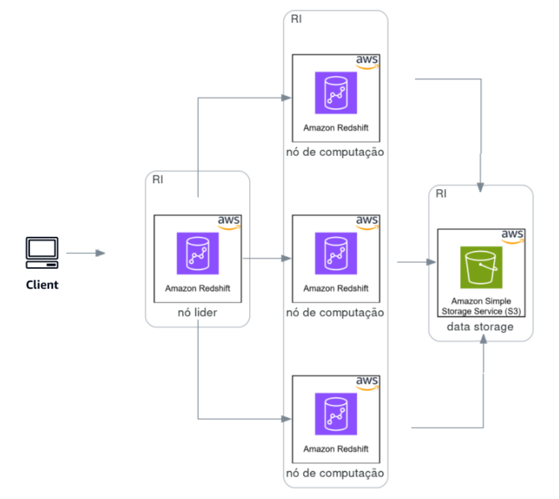

= Cenário Arquitetural: MultiNuvem Banco de Dados

ifndef::env-gitlab[]
image::../../cenario_arquitetural.PNG[,60%]
endif::[]
ifdef::env-gitlab[]
image::../../images/cenario_arquitetural.PNG[,60%]
endif::[]
{blank} +

*Histórico de Revisões*
|===
| Data | Versão | Descrição | Autor
| 27/12/2024
| 1.0
| Criação do Documento.
| Adelson DaSilva
|===
===== Amazon Redshift 
* Principais Aplicações: 
- Data warehouse
* Cenário arquitetural:
- Data warehouse do Amazon Redshift

ifndef::env-gitlab[] 
 
endif::[] 
ifdef::env-gitlab[] 
image::/aws_redshift.png[,70%] 
endif::[]
{blank} +

==== IaC (Infrastructure-as-Code, infraestrutura como código)

*Em construção*
