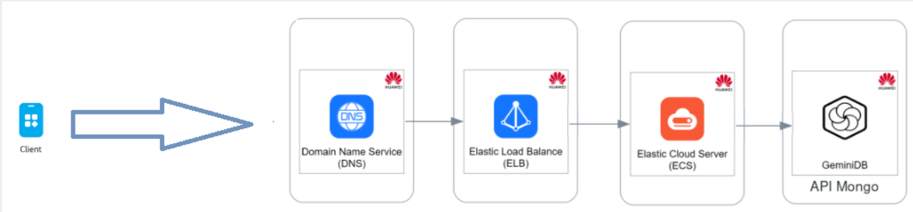
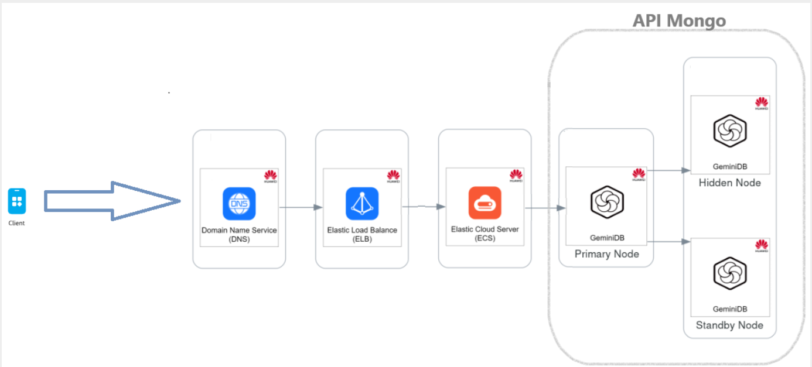

= Cenário Arquitetural: MultiNuvem Banco de Dados

ifndef::env-gitlab[]
image::../../cenario_arquitetural.PNG[,60%]
endif::[]
ifdef::env-gitlab[]
image::../../images/cenario_arquitetural.PNG[,60%]
endif::[]

{blank} +

*Histórico de Revisões*

|===
| Data | Versão | Descrição | Autor

| 27/12/2024
| 1.0
| Criação do Documento.
| Adelson DaSilva

|===
====== API GeminiDB Mongo

* Principais Aplicações: 
Jogos
* Principais Cenários:
- Simgle Instance

ifndef::env-gitlab[] 
 
endif::[] 
ifdef::env-gitlab[] 
image::/geminidb_mongo_single.png[,50%] 
endif::[]

{blank} +
- HA Instance

ifndef::env-gitlab[] 
 
endif::[] 
ifdef::env-gitlab[] 
image::/geminidb_mongo_ha.png[,70%] 
endif::[]

* API compatível: Document-oriented API - MongoDB

* Cenário: É um serviço de banco de dados NoSQL nativo da nuvem e compatível com MongoDB, que usa arquitetura desenvolvida pela Huawei com armazenamento e computação desacoplados.

{blank} +
